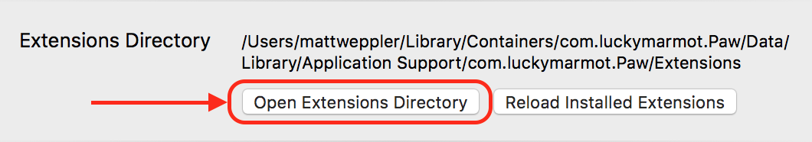
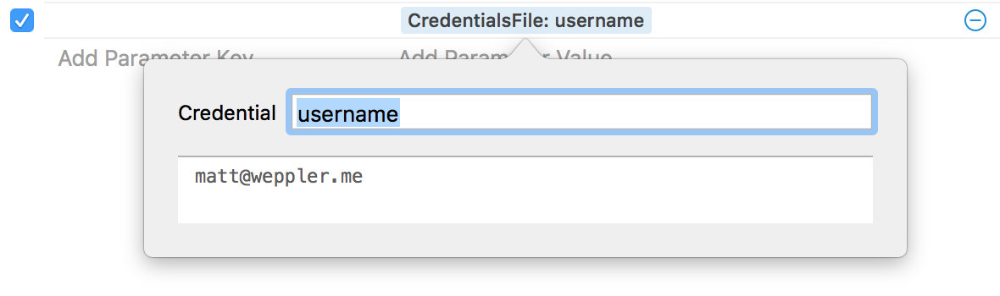

# CredentialsFile (Paw Extension)

A Paw Extension to store and use credentials in a local file.

## Installation

1. Open the Extensions Directory: you can find it in the `Preferences → Extensions`, and hit `Open Extensions Directory`. 

This directory should actually be: `~/Library/Containers/com.luckymarmot.Paw/Data/Library/Application Support/com.luckymarmot.Paw/Extensions`
2. Clone the repository: `git@github.com:mweppler/paw-credentials-file.git me.weppler.CredentialsFile`
3. Copy the default credentials file and add your credentials:

        $ cd me.weppler.CredentialsFile
        $ cp credentials.default.json credentials.json
        $ vim credentials.json
        
        {
          "password": "secret",
          "username": "matt@weppler.me"
        }

4. Use it in your paw file by typing `{C` and `CredentialsFile:` should pop up.
5. Right-click on: `CredentialsFile:` and in the `Credential` field, type the key of a credential (_i.e. username or password_)

## License

This Paw Extension is released under the [MIT License](https://github.com/mweppler/paw-credentials-file/blob/master/LICENSE). Feel free to fork, and modify!

Copyright © 2016 [Matt Weppler](http://matt.weppler.me).

## Contributors

See [Contributors](https://github.com/mweppler/paw-credentials-file/graphs/contributors).